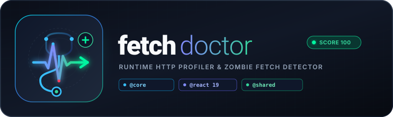

<p align="center">
  
</p>

# fetch-doctor

> **Catch zombie fetches, unhandled network leaks, and missing AbortControllers in React 19 and modern web applications.**

[](https://www.npmjs.com/package/@fetch-doctor/core)
[](https://www.npmjs.com/package/@fetch-doctor/react)
[](https://www.npmjs.com/package/@fetch-doctor/shared)
[](LICENSE)

---

## Feature Comparison Matrix

| Feature | Native Fetch API | Axios | @fetch-doctor |
| :--- | :--- | :--- | :--- |
| Automatic Unmount Cancellation | Manual AbortController | Manual cancel token | Automatic via `useTrackFetch` |
| Zombie Request Detection | None | None | Built-in via interceptor & CDP |
| Missing AbortSignal Hygiene | None | None | Runtime enforcement & diagnostics |
| Real-time Diagnostic Overlay | None | None | Shadow DOM HUD (Dev mode only) |
| Headless Network Auditing | None | None | Built-in Puppeteer CDP scanner |

---

## Live Demos & Official Packages

- **Web Scanner App**: [fetch-doctor.vercel.app](https://fetch-doctor.vercel.app/)
- **Interactive Playground**: [fetch-doctor-playground.vercel.app](https://fetch-doctor-playground.vercel.app)
- **GitHub Repository**: [github.com/mmy-lana/fetch-doctor](https://github.com/mmy-lana/fetch-doctor)

### Official npm Packages

- [`@fetch-doctor/core`](https://www.npmjs.com/package/@fetch-doctor/core) — Core Interceptor Engine & Floating Overlay
- [`@fetch-doctor/react`](https://www.npmjs.com/package/@fetch-doctor/react) — React 19 Lifecycle Hooks & Diagnostic Observers
- [`@fetch-doctor/shared`](https://www.npmjs.com/package/@fetch-doctor/shared) — Shared Types, Formatters & CDP Audit Utilities

---

## What is Fetch Doctor?

### Simple Explanation (For Non-IT Users)
Imagine your web browser is like a restaurant kitchen, and internet requests are waiters taking orders. 

When you leave a page or close a pop-up, a **"Zombie Fetch"** happens when a waiter keeps bringing food to a table that no longer exists—wasting memory, slowing down your device, and causing invisible glitches.

**Fetch Doctor** acts as an automated health inspector inside your web app that catches these wasted requests, alerts developers in real-time, and provides a health score to keep websites fast and responsive.

### Technical Explanation (For Developers & Infrastructure Engineers)
**Fetch Doctor** is a lightweight monorepo suite that intercepts the global `window.fetch` API without external runtime dependencies. It inspects outgoing requests for missing `AbortSignal` controllers, tracks active HTTP requests against component lifecycle unmounts, detects network latency bottlenecks (>2000ms), flags 4xx/5xx HTTP errors, and renders a Shadow-DOM floating debug overlay in development.

---

## Key Problems Solved

1. **Zombie Fetches**: Detects HTTP requests that continue processing or resolving after an `AbortSignal` has been triggered or after a caller component unmounted.
2. **Missing `AbortSignal` Hygiene**: Flags network requests initiated without cancellation signals, preventing memory leaks on slow networks.
3. **Latency Profiling**: Identifies slow API endpoints exceeding configurable thresholds.
4. **Automated Headless CDP Auditing**: Features a Next.js 15+ Puppeteer Chrome DevTools Protocol (CDP) serverless auditor to scan any live URL.

---

## Monorepo Architecture

```text
fetch-doctor-monorepo/
├── apps/
│   ├── web/          # Next.js 15+ Headless Puppeteer CDP Scanner UI
│   └── playground/   # Vite + React 19 Interactive Test Bed
└── packages/
    ├── core/         # @fetch-doctor/core: Window Fetch Interceptor & Floating Debug Overlay
    ├── react/        # @fetch-doctor/react: React Hooks (useFetchDoctor, useTrackFetch)
    └── shared/       # @fetch-doctor/shared: Shared Interfaces, Formatters & ANSI Logger
```

---

## Step-by-Step Integration Guide

### Option 1: React 19 / Modern React Integration

Install the primary React integration package (bundles and re-exports core utilities and TypeScript types):

```bash
npm install -D @fetch-doctor/react
# or
pnpm add -D @fetch-doctor/react
```

#### 2. Initialize in App Root (`App.tsx`)
```tsx
import { useFetchDoctor, useFetchDoctorDiagnostics } from '@fetch-doctor/react';

export default function App() {
  // Automatically attaches interceptor and mounts floating debug overlay in dev
  useFetchDoctor({ enableOverlay: true });

  const { summary, logs } = useFetchDoctorDiagnostics();

  return (
    <div>
      <h1>My App (Health Score: {summary.score}/100)</h1>
    </div>
  );
}
```

#### 3. Prevent Zombie Fetches with `useTrackFetch`
```tsx
import { useTrackFetch } from '@fetch-doctor/react';

function UserProfile() {
  const trackedFetch = useTrackFetch();

  const loadData = async () => {
    // Automatically aborted when UserProfile unmounts
    const res = await trackedFetch('/api/user');
    const data = await res.json();
  };

  return <button onClick={loadData}>Load Profile</button>;
}
```

---

### Option 2: Vanilla JavaScript / Core Engine

For non-React browser applications, install the core engine package directly:

```bash
npm install -D @fetch-doctor/core
# or
pnpm add -D @fetch-doctor/core

```typescript
import { initFetchDoctor, getDiagnostics, subscribeDiagnostics } from '@fetch-doctor/core';

// Initialize core engine
initFetchDoctor({
  enableOverlay: true,
  overlayPosition: 'bottom-right',
  rules: {
    slowThresholdMs: 2000,
    requireAbortSignal: true,
  },
  onIssueDetected: (issue) => {
    console.warn(`[fetch-doctor] Issue detected [${issue.type}]:`, issue.message);
  },
});

// Listen to real-time diagnostic updates
subscribeDiagnostics((logs, summary) => {
  console.log('Current Health Score:', summary.score);
});
```

---

## Local Monorepo Setup

To clone and run the entire monorepo suite locally:

```bash
# 1. Clone the repository
git clone https://github.com/mmy-lana/fetch-doctor.git
cd fetch-doctor

# 2. Install workspace dependencies
pnpm install

# 3. Build all workspace packages
pnpm build

# 4. Start local development servers
pnpm dev
```

- **Playground**: Local React app running at `http://localhost:5173`
- **Web Scanner**: Local Next.js server running at `http://localhost:3000`

---

## Roadmap & Next Big Things

- [ ] **Automated CI GitHub Action**: Run headless URL network health checks in GitHub Pull Requests.
- [ ] **Axios & GraphQL Interceptors**: Native adapters for Axios, TanStack Query, and Apollo Client.
- [ ] **AI-Powered Diagnostics**: Natural language suggestions for optimizing API response payloads and edge caching.
- [ ] **Har & Waterfall Exporter**: Export captured network logs to standard `.har` diagnostic format for Chrome DevTools import.

---

## License

Distributed under the **MIT License**. See `LICENSE` for more information.
